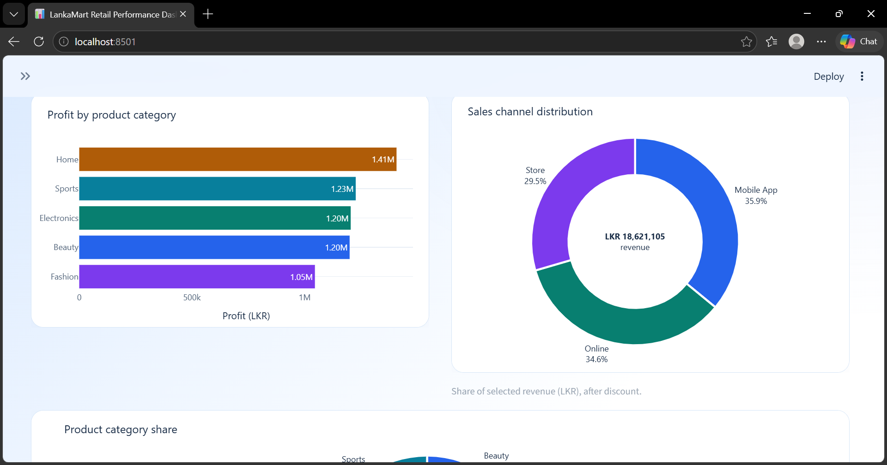
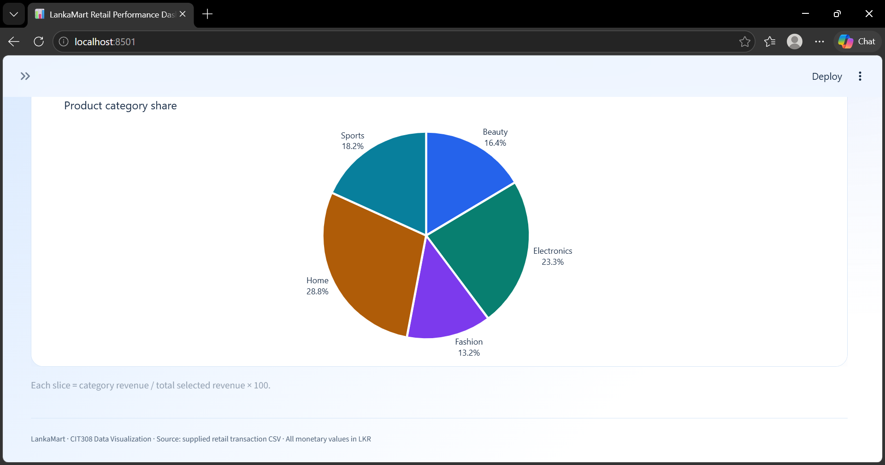
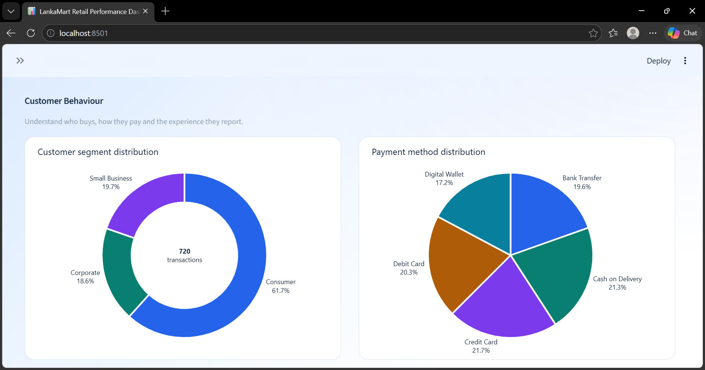
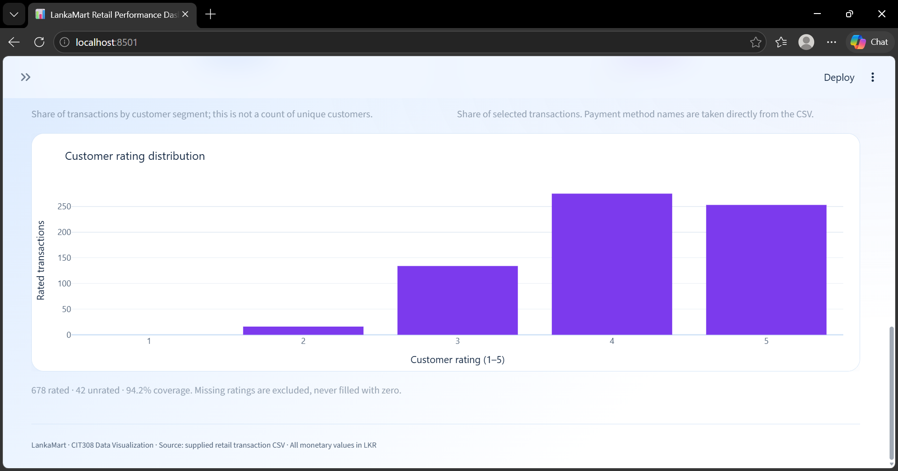
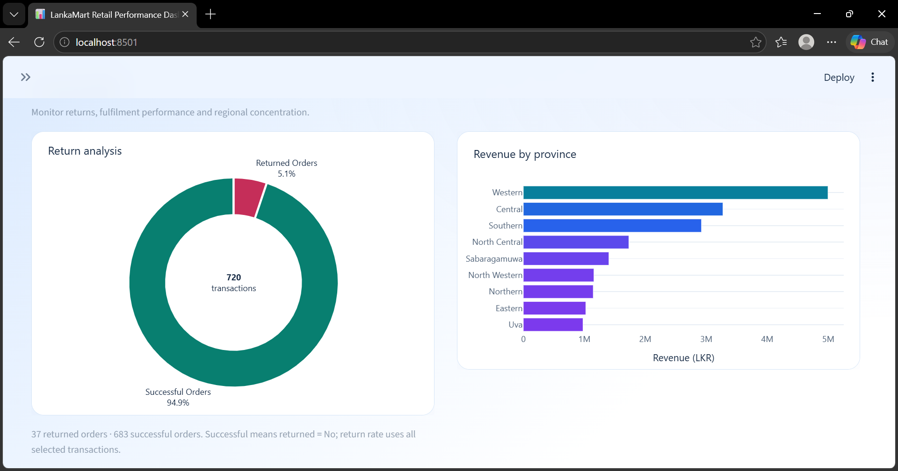
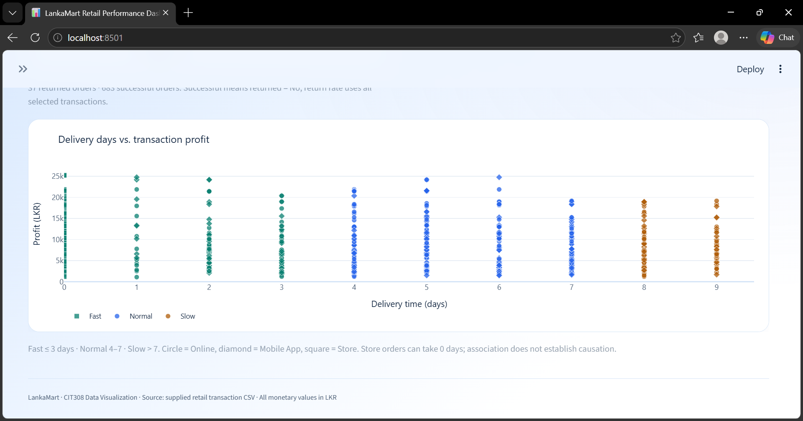
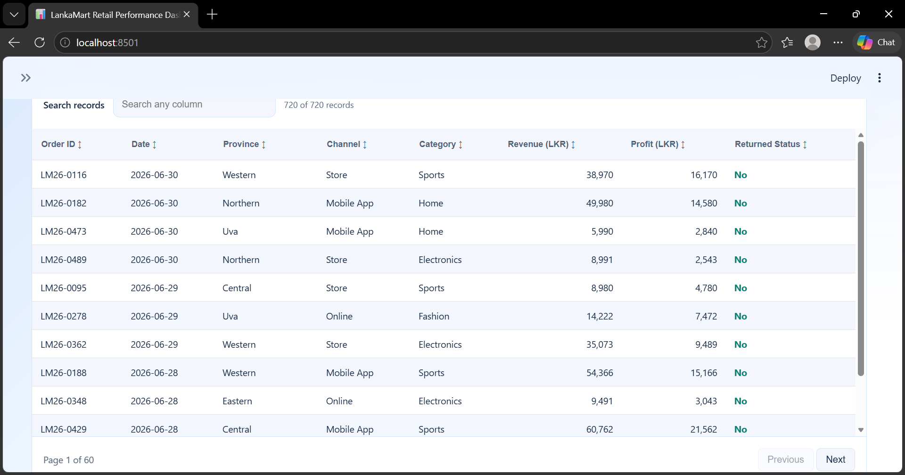
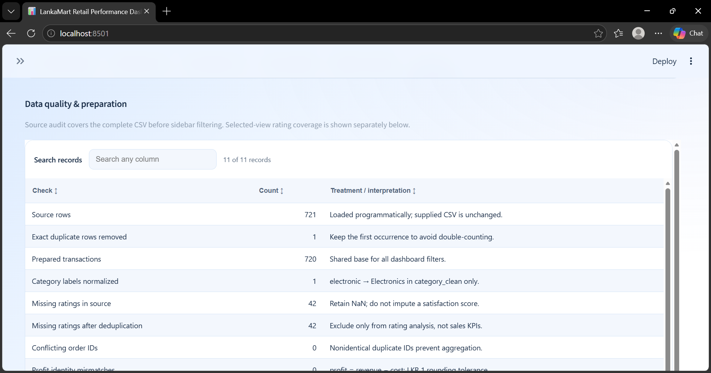
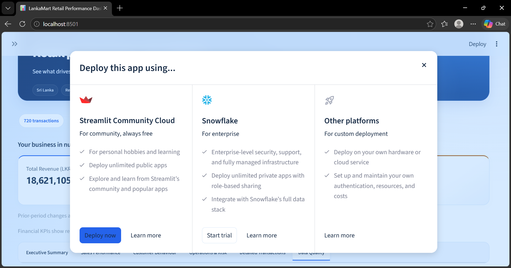
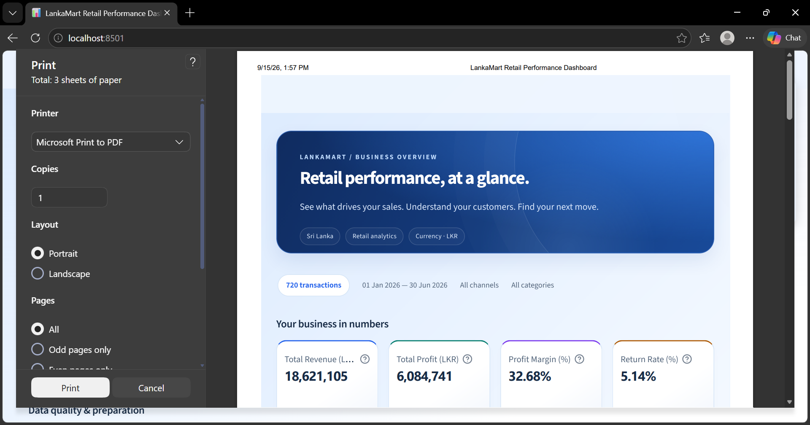

# LankaMart Retail Performance Dashboard

**Author: MCM.Nujooth**

A complete local Streamlit dashboard for the CIT308 Data Visualization Mid Semester Evaluation. It answers: **How is LankaMart performing, where are the main risks or opportunities, and what actions should management consider?**

The application reads only the supplied `CIT308_LankaMart_Retail_Transactions.csv`. It does not generate replacement transactions, call an external data service, or hard-code KPI or chart values.

**Python 3.10+ · Streamlit · Pandas · Plotly · NumPy**

[Screenshots](#screenshots) · [Install and run](#install-and-run) · [Upload to GitHub](#upload-to-github) · [Data preparation](#data-preparation-and-preservation) · [Validation](#libraries-and-validation)


## Screenshots

All **13 screenshots** from `lanka mart screen shot.zip` are included in `screenshots/submitted/`, with their original filenames and image quality preserved. The overview appears above; expand the sections below to view the other 12 screenshots.

<details>
<summary><strong>Executive Summary — management insights</strong></summary>

**Management insight cards covering regional opportunity, category margins, returns and fulfilment**


</details>

<details>
<summary><strong>Sales Performance — revenue, profit and sales mix</strong></summary>

**Monthly revenue and profit trend in LKR**


**Profit by product category and sales channel revenue distribution**



**Product category share of selected revenue**



</details>

<details>
<summary><strong>Customer Behaviour — segments, payments and ratings</strong></summary>

**Customer segment and payment method distributions**



**Customer rating distribution and rated transaction coverage**



</details>

<details>
<summary><strong>Operations &amp; Risk — returns, regions and delivery</strong></summary>

**Return analysis and revenue by province**



**Delivery days versus transaction profit by fulfilment band**



</details>

<details>
<summary><strong>Detailed Transactions and Data Quality</strong></summary>

**Searchable transaction table with revenue, profit and returned status**



**Data quality audit with preparation and validation checks**



</details>

<details>
<summary><strong>Additional captures — deployment options and print preview</strong></summary>

**Streamlit deployment options dialog**



**Browser print preview of the LankaMart dashboard**



</details>

See the [screenshot index](screenshots/README.md) for all original filenames. These are static captures; run the app to use its interactive filters and charts. The deployment and print captures show those dialogs, rather than a published app or an exported report.

## Enhanced dashboard

The dashboard contains **10 interactive Plotly charts** and a sidebar **Dashboard Theme** selector with **Light Mode** and **Dark Mode**. The six tabs organize the analysis into Executive Summary, Sales Performance, Customer Behaviour, Operations & Risk, Detailed Transactions, and Data Quality. KPI cards stay visible across tabs, and the summary tab presents management insights.

The design combines a deep-blue header, a soft blue-and-white page gradient, clean KPI cards, numbered insight cards and coordinated filters and tabs. Charts use consistent category colors and clear labels. Card entrances, gentle header movement, tab transitions, and hover effects provide animation without changing chart values. Use the sidebar **Animations** switch to turn movement off; the browser/operating system's reduced-motion preference is also respected. Screenshots capture the final visual state with animations paused.

Both themes update backgrounds, text, KPI cards, filters, charts, and table headers/cells/search/pagination. Light Mode uses blue-and-white surfaces with distinct chart accents with `plotly_white`; Dark Mode uses bright accents on navy surfaces with `plotly_dark`. Shared palettes live in `utils/themes.py`; the selection is kept in the current Streamlit session. Resetting filters preserves the selected theme. No process-wide configuration is mutated, so separate browser sessions can choose different themes.

The transaction table is an isolated HTML/JavaScript component rendered through Streamlit. It supports header-click sorting, search, pagination, keyboard focus and horizontal scrolling. This allows explicit theme colors for the entire table, including headers and controls, without extra runtime packages. Table search affects only its visible rows; the download contains the complete sidebar-filtered selection. Source-audit tables use the same themed component.

KPI cards include conditional prior-period indicators. The previous window has the same number of inclusive calendar days and uses the same channel/category filters. Changes appear only if that complete preceding window lies within the source date coverage and contains matching records. Revenue/profit changes are percentages, using the absolute previous amount as denominator; a zero baseline gives no percentage change. Margin and return-rate changes are **percentage points (pp)**. A lower return rate is favorable. The complete source-period view correctly has no prior comparison; no baseline is invented.

## Install and run

Use Python **3.10 or later**. Download or clone this repository, then open a terminal in the folder containing **both `app.py` and `requirements.txt`**. If your terminal is in the parent `LankaMart` folder, enter the project first:

```powershell
Set-Location .\LankaMart_Dashboard
```

For a fresh installation on Windows:

```powershell
python -m venv .venv
.\.venv\Scripts\python.exe -m pip install -r requirements.txt
.\.venv\Scripts\python.exe -m streamlit run app.py
```

Open the local URL printed by Streamlit, normally **http://localhost:8501**. Stop the server with `Ctrl+C`. Calling the environment's Python directly avoids PowerShell activation-policy problems.

On macOS or Linux:

```bash
python3 -m venv .venv
.venv/bin/python -m pip install -r requirements.txt
.venv/bin/python -m streamlit run app.py
```

If your virtual environment is already active, keep using it instead of recreating it:

```bash
python -m pip install -r requirements.txt
python -m streamlit run app.py
```

The dataset path is resolved relative to the source files, so data loading does not depend on the terminal's current directory. Launch from this project directory to load its Streamlit theme configuration.

If Python reports that `requirements.txt` or `app.py` does not exist, check the current directory before running the commands again. Both files are in `LankaMart_Dashboard`, one level below the original `LankaMart` workspace.

## Upload to GitHub

Use **the contents of `LankaMart_Dashboard` as the repository root**. The root should contain `app.py`, `README.md`, `requirements.txt`, `.gitignore`, `.gitattributes`, `.streamlit/`, `data/`, `utils/`, `tests/` and `screenshots/`.

If using `LankaMart_Dashboard_GitHub.zip`, extract it first and open the included `LankaMart_Dashboard` folder. Upload or commit its contents, including the screenshot directories. Uploading only the ZIP will not create a browsable source project or render this README gallery.

For a new repository, create an empty GitHub repository named `LankaMart_Dashboard` without adding another README, license or `.gitignore`. With Git installed and GitHub authentication configured, open a terminal **inside the dashboard folder** and run:

```powershell
git init -b main
git rev-parse --show-toplevel
```

Confirm that the printed path is the dashboard folder before continuing. This establishes a separate project repository even if a parent directory already belongs to another Git repository.

```powershell
git status --short
git add .
git commit -m "Add LankaMart dashboard with screenshots and documentation"
```

Replace `YOUR_USERNAME` in the following example with your GitHub username, and use your actual repository name if different:

```powershell
git remote add origin https://github.com/YOUR_USERNAME/LankaMart_Dashboard.git
git push -u origin main
```

The `.gitignore` excludes virtual environments, caches, logs and local secrets. `.gitattributes` standardizes source-file line endings while preserving the supplied CSV bytes. Images use relative paths, so the gallery works without an account-specific image URL. See GitHub's [guide to adding an existing project](https://docs.github.com/en/migrations/importing-source-code/using-the-command-line-to-import-source-code/adding-locally-hosted-code-to-github) and [relative image-path documentation](https://docs.github.com/en/get-started/writing-on-github/getting-started-with-writing-and-formatting-on-github/basic-writing-and-formatting-syntax#relative-links).

## Project structure

```text
LankaMart_Dashboard/
├── app.py
├── requirements.txt
├── README.md
├── .gitignore
├── .gitattributes
├── .streamlit/
│   └── config.toml
├── data/
│   └── CIT308_LankaMart_Retail_Transactions.csv
├── utils/
│   ├── __init__.py
│   ├── data_processing.py
│   ├── charts.py
│   ├── themes.py
│   └── tables.py
├── tests/
│   ├── test_dashboard.py
│   ├── capture_screenshots.py
│   └── validate_enhancements.py
└── screenshots/
    ├── README.md
    ├── validation_results.json
    └── submitted/       # All 13 original screenshots from the supplied ZIP
```

## Use the dashboard

1. Choose an inclusive start and end date in the sidebar.
2. Select one or more sales channels and product categories. The category filter uses normalized labels.
3. Choose **Light Mode** or **Dark Mode**, then explore **Sales Performance**, **Customer Behaviour**, and **Operations & Risk**. Hover for exact amounts, zoom into plots, or use the Plotly toolbar to save an image.
4. Review the four KPIs and the four management insights in **Executive Summary**. Each insight states evidence for the selection and an action to consider.
5. Open **Detailed Transactions** for the sortable, searchable table and download of all filtered fields.
6. Open **Data Quality** for source checks and calculation definitions.
7. Select **Reset all filters** to return to the full dataset.

All analytical outputs use one filtered dataframe. Empty category/channel selections mean no transactions, rather than silently reverting to all. Empty results show zero monetary totals, undefined percentage KPIs (`N/A`), and a clear message. A partially entered date range prompts you to select both endpoints. The source audit is explicitly labeled as a full-file audit; rating coverage also reports the selected view.

## KPIs and charts

| Output | Calculation or purpose |
| --- | --- |
| Total Revenue (LKR) | Sum of recorded `revenue_lkr` after discount |
| Total Profit (LKR) | Sum of recorded `profit_lkr` |
| Profit Margin (%) | Total profit / total revenue × 100, not the mean of transaction margins |
| Return Rate (%) | Transactions marked `returned = Yes` / all selected transactions × 100 |
| Monthly revenue and profit | Two line series on one LKR axis, with distinct line styles and symbols |
| Profit by product category | Sorted horizontal bars to compare category contribution |
| Revenue by province | Sorted horizontal bars for readable comparisons across provinces |
| Customer rating distribution | Histogram with fixed one-point bins centered on ratings 1–5 |
| Delivery days vs. transaction profit | One scatter point per transaction; band color, channel symbol, revenue in hover |
| Sales channel distribution — donut | Channel revenue / selected total revenue × 100 |
| Return analysis — donut | Returned or successful transactions / all selected transactions × 100 |
| Customer segment distribution — donut | Segment transactions / all selected transactions × 100 |
| Payment method distribution — pie | Transactions using each payment method / all selected transactions × 100 |
| Product category share — pie | Category revenue / selected total revenue × 100 |

All five pie/donut charts show category names, percentage labels and interactive hover details. Channel and category distributions use revenue; customer segments, payments and returns use transaction counts. Segment shares do not imply unique customer counts because customer IDs are unavailable. “Successful Orders” means `returned = No`, not an inferred customer-satisfaction or delivery result. Payment names remain exactly as supplied (for example, Cash on Delivery and Digital Wallet); no example payment categories are fabricated. Category/channel/segment/payment color assignments stay stable across filter selections.

Exact currency amounts use LKR labels and grouping separators. Chart axes can abbreviate thousands as `k` and millions as `M`; hover labels show full amounts. The chart layout uses a consistent navy/teal palette, readable text, and symbols or labels alongside colors. On small screens, Streamlit stacks columns and collapses the sidebar.

## Data preparation and preservation

Reusable functions in `utils/data_processing.py` perform these steps:

- **Load:** `pandas.read_csv` reads the supplied CSV. Only empty cells are interpreted as missing, preserving the legitimate promotion label `None`.
- **Inspect types and missingness:** the source audit lists inferred dtypes, parsing failures and per-column missing counts and percentages.
- **Check duplicates:** identify exact repeated rows separately from conflicting order IDs. Exact repeats are removed once, keeping their first occurrence. Conflicting nonidentical IDs stop aggregation with an explanatory error.
- **Validate ranges:** units are positive integers; prices, revenue and costs are nonnegative; discount is a fraction from 0 to 1; delivery days are nonnegative integers; supplied ratings are from 1 to 5. Profit can be negative. Nonfinite numeric values and missing required fields prevent aggregation.
- **Check arithmetic:** compare source profit with revenue minus cost, and revenue with units × unit price × (1 − discount). A one-rupee tolerance accommodates integer rounding. Any discrepancies are reported without silently rewriting monetary values. Nonzero Store delivery times are also flagged.
- **Normalize the observed category inconsistency:** map `electronic` to `Electronics` in the new `category_clean` field. The original `product_category` remains intact. This spelling correction is the only category alias; financial observations are never entered manually.
- **Convert dates:** parse `order_date` as datetime, retaining its original text in `order_date_raw`.
- **Create row profit margin:** `profit_lkr / revenue_lkr * 100`. Zero-revenue rows receive an undefined margin rather than infinity. KPI and category margins are computed independently as ratios of summed amounts.
- **Create month:** use a month-start datetime derived from `order_date`. Retaining the year avoids mixing identically named months across years. Monthly charts include zeros for no-order months inside the selected date range; first and last months can be partial.
- **Create delivery bands:** Fast ≤ 3 days; Normal 4–7 days; Slow > 7 days. Store records with zero days are valid.
- **Handle missing ratings:** preserve missing values without filling them with zero or the mean. Unrated transactions still count toward sales, profits and returns. Only rating analysis excludes them; response coverage is visible.
- **Create flags:** `is_returned` supports the return-rate denominator, and `rating_available` supports response coverage.

The raw dataframe is not mutated. The copied CSV is unchanged. All transformations run in code and the cache refreshes if the CSV file's modification time changes. The full filtered export includes original columns and the calculated fields.

## Management interpretation

The automated insights identify the leading revenue province and its share, the category with the lowest weighted profit margin, the selected return rate and count, and the proportion of Online/Mobile App transactions exceeding seven delivery days. Actions focus on stock availability, discount/cost review, return reason collection and courier capacity. The fulfilment insight states its Online/Mobile App denominator because zero-day Store orders have a different operating model.

Interpret the findings with these limits:

- Revenue and profit are the source's recorded amounts, including returned orders. The dataset does not establish extra refund, reverse-logistics or write-off costs; the app does not infer them.
- Missing ratings may be systematically different from submitted ratings, so satisfaction summaries may be biased.
- Product mix, order size and channel can confound the delivery/profit relationship. The scatter plot describes association, not causation.
- The supplied assessment data cover a limited period. They do not establish annual seasonality, future performance, or real-world retailer behavior.
- Duplicate handling follows the brief's unique-order-ID definition. A future dataset with valid multiple order lines per ID would require a revised key policy.

## Libraries and validation

- **Streamlit:** layout, widgets, session state, caching, metrics, table and download.
- **Pandas:** CSV loading, validation, date conversion, filtering and aggregation.
- **Plotly:** interactive line, bar, histogram, scatter, pie and donut figures.
- **NumPy:** numerical validation and undefined ratios.

Run the included tests after installing the four runtime dependencies:

```powershell
.\.venv\Scripts\python.exe -m unittest discover -s tests -v
```

The 11 automated tests use only supplied CSV records. They independently recalculate totals with Python's CSV reader and decimal arithmetic, verify preservation and cleaning, check delivery boundaries and missing ratings, reconcile all ten chart datasets with filtered KPIs and the transaction table, and exercise each filter, combined filters, reset, incomplete dates, single-day dates and empty states. They also verify theme switching, theme preservation on reset, each pie/donut denominator and prior-period calculations. Streamlit's test runner can emit a harmless `missing ScriptRunContext` warning when initialized outside a live server.

**Saved validation results:** [screenshots/validation_results.json](screenshots/validation_results.json) records the environment and checks from an earlier validation run. The current README gallery embeds all 13 user-supplied images indexed in [screenshots/README.md](screenshots/README.md); these supplied captures are separate from automated validation results. To generate fresh browser evidence in `screenshots/enhanced/`, install the optional browser tooling and keep the local Streamlit server running:

```powershell
.\.venv\Scripts\python.exe -m pip install playwright
.\.venv\Scripts\python.exe -m playwright install chromium
.\.venv\Scripts\python.exe tests/capture_screenshots.py
```

Playwright is only used for browser validation/screenshots and is not required to run the dashboard.

The browser check verifies all ten charts in both themes and each filtered state, actual table searching/sorting/pagination, the date selector, filtered CSV download, and mobile sidebar collapse. Screenshot generation waits for chart updates and captures the currently selected tab with its sidebar and KPI context.

## Assignment submission context

This folder is the runnable project requested by the user. The supplied assignment brief separately specifies a **1,200–1,500-word PDF report**, named `CIT308_Mid_StudentID.pdf`, as the LMS submission. The brief calls for a complete dashboard screenshot, two different filtered states and a detailed/analytical view, plus findings, recommendations, limitations, references and an assistance declaration. The project and screenshots support preparing that report; a PDF report is not included here. Include an accurate declaration of AI assistance and follow the lecturer's rules for permitted use.

## References

- [Streamlit API documentation](https://docs.streamlit.io/develop/api-reference)
- [Streamlit AppTest documentation](https://docs.streamlit.io/develop/api-reference/app-testing/st.testing.v1.apptest)
- [Pandas documentation](https://pandas.pydata.org/docs/)
- [Plotly Python documentation](https://plotly.com/python/)
- [NumPy documentation](https://numpy.org/doc/stable/)
- Supplied `CIT308_Mid_Semester_Assignment_Specification.docx` and `CIT308_LankaMart_Retail_Transactions.csv`.
